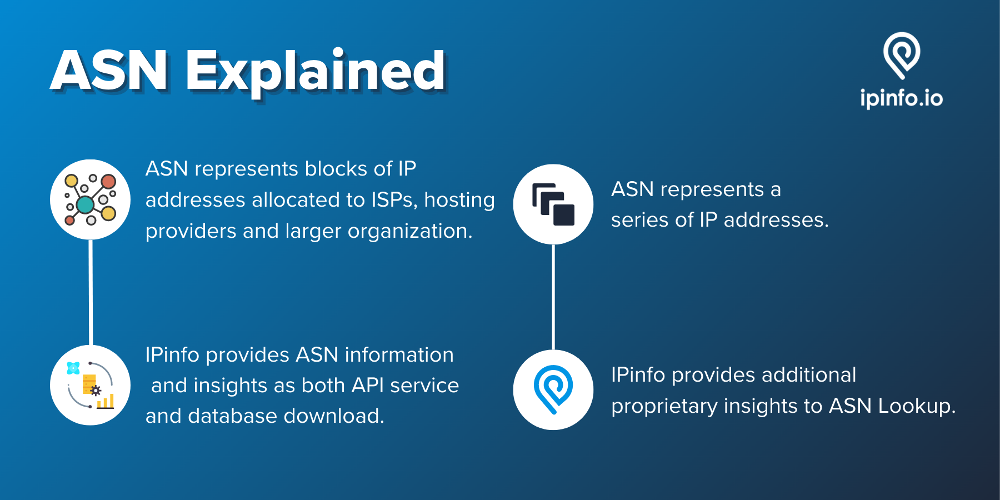
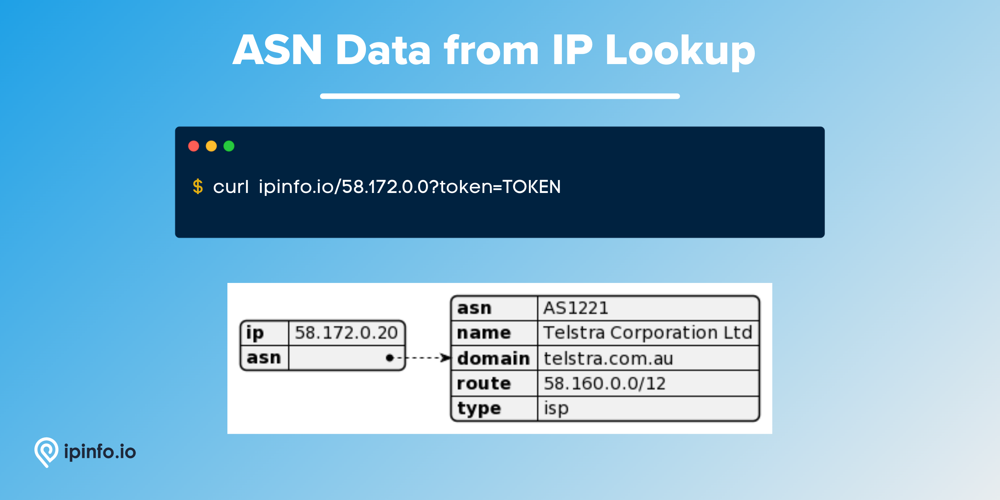
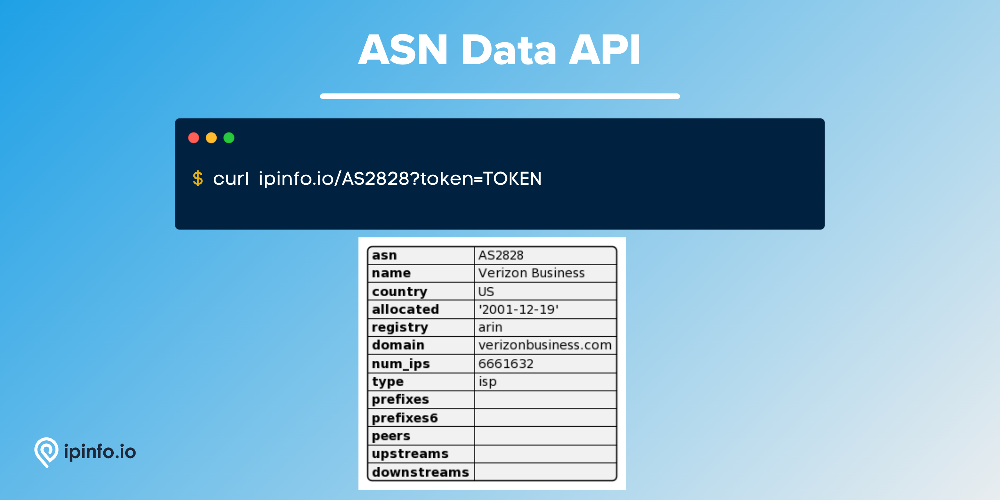

# ASN Database

## ASN represents blocks of IP Addresses that are owned by large organizations. Get IP address range, domain, and organizational information relating to the ownership of the ASN.



# Database Schema & Description

*[data updated as of August, 2022]*

| Field Name | Example | Data Type | Notes |
| --- | --- | --- | --- |
| `start_ip` | 125.113.0.0 | TEXT | Starting IP address of the ASN IP address block |
| `end_ip` | 125.113.255.255 | TEXT | Ending IP address of the ASN IP address block |
| `join_key` | 125.113.0.0 | TEXT | Special variable to facilitate join operation |
| `asn` | AS4134 | TEXT | Autonomous System Number (ASN) |
| `domain` | chinatelecom.com.cn | TEXT | Domain name of the AS |
| `name` | CHINANET-BACKBONE | TEXT | Name of the ASN |
| `type` | isp | TEXT | ASN Type: ISP, Hosting, Education or Business |
| `country` | CN | TEXT | ISO 3166 country code |

> `join_key` → This key represents the Class C network each IP address is part of, allowing you to filter the result set significantly before filtering to the exact IP address you want. [[*Source*](https://ipinfo.io/blog/ingesting-ipinfo-geolocation-data-with-postgresql-13/)]
> 

IP address data like `start_ip`, `end_ip` and `join_key` should be assigned `inet` data type if you are ingesting the data in PostgreSQL.

# ASN API

As well as the database product, IPinfo also provides a robust API service. Please visit the [IPinfo Documentation](https://ipinfo.io/developers) portal to learn more.

## **ASD data from IP Address lookup**

```bash
$ curl ipinfo.io/IP_ADDRESS?token=TOKEN
```



## **ASN data API**

```bash
$ curl ipinfo.io/ASN?token=TOKEN
```



# Samples

- [CSV Database] [ASN Database Sample](/ASN%20Database/asn_sample.csv)
- [JSON Database] [ASN Database Sample](/ASN%20Database/asn_sample.json)
- [MMDB Database] [ASN Database Sample](/ASN%20Database/asn_sample.mmdb)
- [API] [ASN Lookup API Response Sample](/ASN%20Database/asn_lookup_api_sample.json)
- [API][IP Address to ASN API Response Sample](/ASN%20Database/ip_address_to_asn_api_sample.json)

# Guides, Resources & Links

## Links

🔗 [ASN Database Page](https://ipinfo.io/products/asn-database)

🔗 [ASN API Page](https://ipinfo.io/products/asn-api)

 🔗 [ASN API Documentation](https://ipinfo.io/developers/asn)

🔗 [ASN Data Type Documentation](https://ipinfo.io/developers/data-types#asn-data)

## FAQs (Frequently Asked Questions) (1)

- [What is an autonomous system (ASN)?](https://ipinfo.io/faq/article/40-what-is-an-autonomous-system-asn)

---

# Interested in more?

Currently, we are limiting the sample datasets to only **100 rows**. If you would like to request a larger sample or would like to get a quote on the database products **[feel free to reach to us](https://ipinfo.io/products/ip-database-download#request_form)**.

Follow us on [Twitter](https://twitter.com/ipinfoio) and [LinkedIn](https://www.linkedin.com/company/ipinfo/) to learn more about IP Address data and it’s fascinating potential.

# About IPinfo

Founded in 2013, IPinfo prides itself on being the most reliable, accurate, and in-depth source of IP address data available anywhere. We process terabytes of data to produce our custom IP geolocation, company, carrier, VPN detection, hosted domains, and IP type data sets. Our API handles over 40 billion requests a month for 100,000 businesses and developers.

[](https://ipinfo.io/)