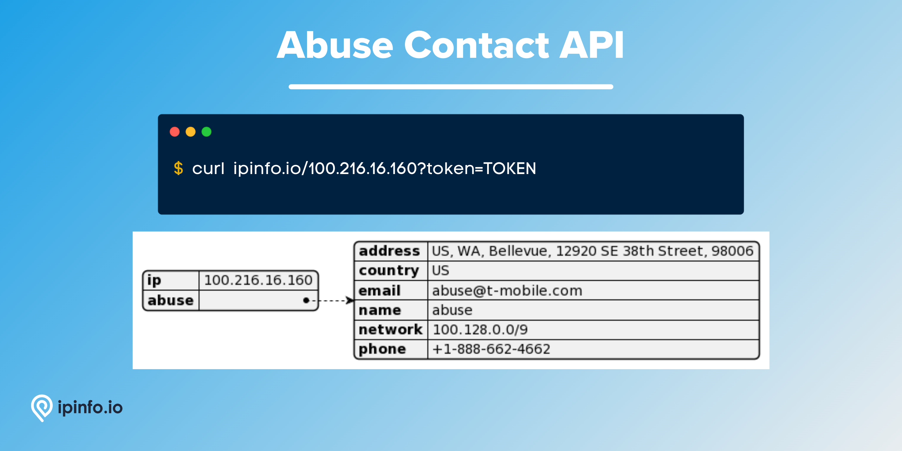

# Abuse Contact Database

## Abuse Contact database provides the contact information of all the ISPs to report hacking, spamming or other nefarious activities.

As of August, 2022 there are almost 33 million entries in the database containing IP address, name, and contact information of ISPs all over the world.

# Database Schema & Description

*[data updated as of August, 2022]*

The following database schema represents the CSV database. We also provide JSON and MMDB format data.

| Field Name | Example | Data Type | Notes |
| --- | --- | --- | --- |
| `start_ip` | 119.93.20.248 | TEXT | Starting IP address of an IP address block |
| `end_ip` | 119.93.20.255 | TEXT | Ending IP address of an IP address block |
| `join_key` | 119.93.0.0 | TEXT | Special variable to make join operations incredibly fast. |
| `name` | Nilo Agir | TEXT | Name of the abuse contact |
| `email` | abuse@pldt.net | TEXT | Organizational email of the abuse contact |
| `address` | Philippine Long Distance Telephone Company, 6/... | TEXT | Organizational address of the abuse contact |
| `country` | PH | TEXT | ISO 3166 country code |
| `phone` | +632-584-1045 | TEXT | Organizational phone number of the abuse contact |

> `join_key` → This key represents the Class C network each IP address is part of, allowing you to filter the result set significantly before filtering to the exact IP address you want. [[*Source*](https://ipinfo.io/blog/ingesting-ipinfo-geolocation-data-with-postgresql-13/)]
> 

IP address data like `start_ip`, `end_ip` and `join_key` should be assigned `inet` data type if you are ingesting the data in PostgreSQL.

# API Response

As well as the database product, IPinfo also provides a robust API service. Please visit the [IPinfo Documentation](https://ipinfo.io/developers) portal to learn more.

```bash
$ curl ipinfo.io/IP_ADDRESS?token=TOKEN
```



# Samples

- [CSV Database] [Abuse Contact Database Sample](/Abuse%20Contact/abuse_contact_sample.csv)
- [MMDB Database] [Abuse Contact Database Sample](/Abuse%20Contact/abuse_contact_sample.mmdb)
- [API] [Abuse Contact API Response Sample](/Abuse%20Contact/abuse_contact_api_sample.json)

# Guides, Resources & Links

## Links

🔗 [Abuse Contact Database Page](https://ipinfo.io/products/ip-abuse-contact-database)

🔗 [Abuse Contact API Page](https://ipinfo.io/products/ip-abuse-contact-api)

🔗 [Abuse Contact Data Type Documentation](https://ipinfo.io/developers/data-types#abuse-contact-data)

## FAQs (Frequently Asked Questions) (1)

- [How to report IP abuse?](https://ipinfo.io/faq/article/86-how-to-report-ip-abuse)

---

# Interested in more?

Currently, we are limiting the sample datasets to only **200 rows**. If you would like to request a larger sample or would like to get a quote on the database products **[feel free to reach to us](https://ipinfo.io/products/ip-database-download#request_form)**.

Follow us on [Twitter](https://twitter.com/ipinfoio) and [LinkedIn](https://www.linkedin.com/company/ipinfo/) to learn more about IP Address data and it’s fascinating potential.

# About IPinfo

Founded in 2013, IPinfo prides itself on being the most reliable, accurate, and in-depth source of IP address data available anywhere. We process terabytes of data to produce our custom IP geolocation, company, carrier, VPN detection, hosted domains, and IP type data sets. Our API handles over 40 billion requests a month for 100,000 businesses and developers.

[](https://ipinfo.io/)