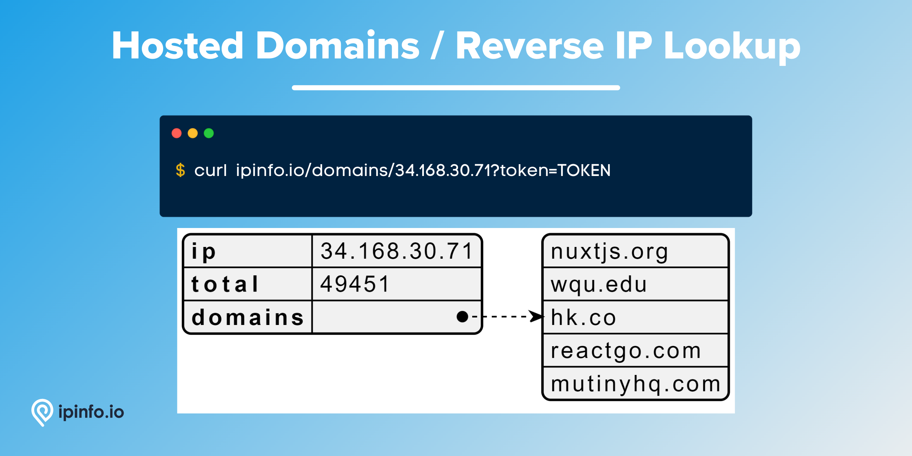

# Hosted Domain Database

## Hosted Domain Database facilitates reverse IP lookup and shows how many and which domains are hosted on which IP Addresses.

*If you are interested in Domain Name API / Database check out: [host.io](https://host.io/)*

# Database Schema & Description

*[data updated as of August, 2022]*

The following database schema represents the CSV database. We also provide JSON and MMDB format data.

| Field Name | Example | Data Type | Notes |
| --- | --- | --- | --- |
| `ip` | 135.125.236.225 | TEXT | IP address for reverse IP lookup |
| `total` | 3 | INTEGER | Number of domains registered to the IP Address |
| `domains` | farmanaut.com,pharmanaut.be,farmanaut.be | TEXT | Name of the domain(s) under the IP address |

Each domain in the `domains` column is separated by a `,` (comma).

# API Response

As well as the database product, IPinfo also provides a robust API service. Please visit the [IPinfo Documentation](https://ipinfo.io/developers) portal to learn more.

🔗 [Hosted Domains Documentation](https://ipinfo.io/developers/hosted-domains)

Basic use case:

```bash
$ curl "ipinfo.io/domains/IP_ADDRESS?token=TOKEN"
```

This will return the full list of domains. So, if you are querying an IP address that hosts many domains, it is best to pipe the data to `less`

You can also limit the names of domains shown with the `limit` parameter.

```bash
curl "ipinfo.io/domains/IP_ADDRESS?token=TOKEN&limit=5"
```



# Samples

- [CSV Database] [Hosted Domains Database Sample](/Hosted%20Domains/hosted_domains_sample.csv)
- [API] [Hosted Domains API Response Sample](/Hosted%20Domains/hosted_domains_api_sample.json)

# Guides, Resources & Links

## Links

🔗 [Hosted Domains Database Page](https://ipinfo.io/products/hosted-domains-database)

🔗 [Hosted Domains API Page](https://ipinfo.io/products/reverse-ip-api)

🔗 [Hosted Domains Documentation](https://ipinfo.io/developers/hosted-domains)

🔗 [Hosted Domains Data Type Documentation](https://ipinfo.io/developers/data-types#hosted-domains-data)

## Articles & Guides (1)

- [Reverse IP lookups: powerful yet overlooked tool](https://ipinfo.io/blog/reverse-ip-lookup-what-is-it-how-it-works)

## FAQs (Frequently Asked Questions) (1)

- [Do you provide domain data?](https://ipinfo.io/faq/article/51-domain-data)

---

# Interested in more?

Currently, we are limiting the sample datasets to only **200 rows**. If you would like to request a larger sample or would like to get a quote on the database products **[feel free to reach to us](https://ipinfo.io/products/ip-database-download#request_form)**.

Follow us on [Twitter](https://twitter.com/ipinfoio) and [LinkedIn](https://www.linkedin.com/company/ipinfo/) to learn more about IP Address data and it’s fascinating potential.

# About IPinfo

Founded in 2013, IPinfo prides itself on being the most reliable, accurate, and in-depth source of IP address data available anywhere. We process terabytes of data to produce our custom IP geolocation, company, carrier, VPN detection, hosted domains, and IP type data sets. Our API handles over 40 billion requests a month for 100,000 businesses and developers.

[](https://ipinfo.io/)