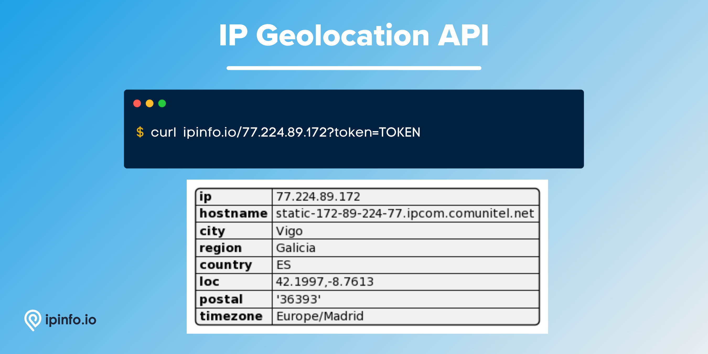

# IP Geolocation Database

## Get location data such as zipcode, city, region, country, location, timezone etc. of IP addresses.

Our IP geolocation data is our primary data product and is considered one of the best in the industry. We operate a large scale network infrastructure consisting of hundreds of servers around the world through which we take active network measurements over the entire internet ecosystem. Through our active measurement, we produce reliable and accurate IP geolocation data. You can learn more about our network from this article:[Probe network - how we make sure our data is accurate](https://ipinfo.io/blog/probe-network-how-we-make-sure-our-data-is-accurate/).

# Database Schema & Description

*[data updated as of January, 2025]*

| Field Name         | Example            | Data Type | Description                                  |
|--------------------|--------------------|-----------|----------------------------------------------|
| **network**        | `71.50.174.48/28`  | TEXT      | CIDR or IP network of the IP address block   |
| **city**           | `Spring Lake`      | TEXT      | City of the IP address                       |
| **region**         | `North Carolina`   | TEXT      | Region/State of the IP address               |
| **region_code**    | `NC`               | TEXT      | Region code in two-letter format in ISO 3166 |
| **country**        | `United States`    | TEXT      | Name of the country of the IP address        |
| **country_code**   | `US`               | TEXT      | ISO 3166 country code of the IP address      |
| **continent**      | `North America`    | TEXT      | Name of the continent                        |
| **continent_code** | `NA`               | TEXT      | Continent name code in two-letter format     |
| **latitude**       | `35.16794`         | FLOAT     | Latitude value of the IP address             |
| **longitude**      | `-78.97281`        | FLOAT     | Longitude value of the IP address            |
| **timezone**       | `America/New_York` | TEXT      | Local timezone of the IP address location    |
| **postal_code**    | `28390`            | TEXT      | Postal code or zip code of the IP address    |

<details>

<summary><h3>Alternate Database Schema: <code>standard_location</code></h3></summary>

The `standard_location` data download is structured based on IP ranges (`start_ip` and `end_ip`). It includes the `join_key` column but does not include the columns `region_code` and `country_code` (as the country code is contained in the `country` column and it does not provide the name of the country). Additionally, it does not include the columns `continent` and `continent_name`.

Our default data downloads has been updated (January, 2025) to use the `network`-based schema which also does not include the `join_key` column. However, we will continue supporting the original IP range-based schema for existing customers, with no plans for deprecation. While the underlying data remains the same, the difference lies only in the schema.

| Field Name      | Example            | Data Type | Description                                              |
|-----------------|--------------------|-----------|----------------------------------------------------------|
| **start_ip**    | `1.253.242.0`      | TEXT      | Starting IP address of an IP address range               |
| **end_ip**      | `1.253.242.255`    | TEXT      | Ending IP address of an IP address range                 |
| **join_key**    | `1.253.0.0`        | TEXT      | Special variable to facilitate database `join` operation |
| **city**        | `Yangsan`          | TEXT      | City of the IP address                                   |
| **region**      | `Gyeongsangnam-do` | TEXT      | Region of the IP address                                 |
| **country**     | `KR`               | TEXT      | ISO 3166 country code of the IP address                  |
| **latitude**    | `35.34199`         | FLOAT     | Latitude value of the IP address                         |
| **longitude**   | `129.03358`        | FLOAT     | Longitude value of the IP address                        |
| **postal_code** | `50593`            | TEXT      | Postal code or zip code of the IP address                |
| **timezone**    | `Asia/Seoul`       | TEXT      | Local timezone of the IP address                         |

> Includes IP range columns (`start_ip` and `end_ip`) instead of a network or CIDR based column (`network`).
> `join_key` represents the Class C network each IP address is part of, allowing you to filter the result set significantly before `join`ing. Learn more about `join_key` [here](https://community.ipinfo.io/t/ipinfos-join-key-column-explained/5526).


#### Samples

- [CSV Database] [IP Geolocation Database Sample](/IP%20Geolocation/ip_geolocation_sample.csv)
- [JSON Database] [IP Geolocation Database Sample](/IP%20Geolocation/ip_geolocation_sample.json)
- [MMDB Database] [IP Geolocation Database Sample](/IP%20Geolocation/ip_geolocation_sample.mmdb)
- [MMDB Database (Standard)] [IP Geolocation Standard Database Sample](/IP%20Geolocation/ip_geolocation_standard_sample.mmdb)

</details>

<details>

<summary><h3>Alternate Database Schema: <code>standard_location_mmcompat</code></h3></summary>

The `standard_location_mmcompat` database schema is a custom database that provides easier migration from alternative providers by offering the `geonames_id` field and other location data. Even though the migration process will not be plug and play from an alternative provider, we provide all the necessary information for users to account for only the schema.

| Field Name         | Example           | Data Type | Descrption                                           |
|--------------------|-------------------|-----------|------------------------------------------------------|
| **Network**        | `50.62.0.0/15`    | TEXT      | CIDR or IP network of the IP address block           |
| **City**           | `Tempe`           | TEXT      | City of the IP address                               |
| **Continent**      | `NA`              | TEXT      | Continent name code in two-letter format             |
| **Country**        | `US`              | TEXT      | ISO 3166 country code of the IP address              |
| **Country_name**   | `United States`   | TEXT      | Name of the country of the IP address                |
| **Geoname_id**     | `5317058`         | TEXT      | Geoname_id that corresponds to geonames.org database |
| **Lat**            | `33.41477`        | FLOAT     | Latitude value of the location                       |
| **Lng**            | `-111.90931`      | FLOAT     | Longitude value of the location                      |
| **Postal**         | `85285`           | TEXT      | Postal code or zip code of the IP address            |
| **Region**         | `AZ`              | TEXT      | Region code in two-letter format in ISO 3166         |
| **Region_name**    | `Arizona`         | TEXT      | Region of the IP address                             |
| **Subregion**      | `013`             | INTEGER   | Subregion code                                       |
| **Subregion_name** | `Maricopa County` | TEXT      | Subregion name                                       |
| **Timezone**       | `America/Phoenix` | TEXT      | Local timezone of the IP address location            |


#### Samples

- [MMDB Database (Standard)] [IP Geolocation Standard Database Sample](/IP%20Geolocation/ip_geolocation_standard_sample.mmdb)

</details>

## Downloadable File Formats

- CSV: Plain text file format where data is organized into rows, with individual values separated by commas.
- JSON: More specifically, NDJSON (Newline Delimited JSON), a text file format where each line is a separated in valid JSON object.
- MMDB: Specialized binary database for efficient and fast IP lookups.
- Parquet: A columnar storage file format optimized for efficient data querying.

> Please refer to "[How to choose the best file format for your IPinfo database?](https://ipinfo.io/blog/ipinfo-database-formats/)" article to select the best format possible for your use case.
>
> The usage of the IP data downloads relies on the software or application of the data. Check out our [documentation](https://ipinfo.io/developers/database-download), [community](https://community.ipinfo.io/c/docs/8), and our [integrations](https://ipinfo.io/integrations) pages to find the best path forward.

## Filename references:


| File Format | Filename / Slug         | Terminal Command                                                                                      |
|-------------|-------------------------|-------------------------------------------------------------------------------------------------------|
| CSV         | ipinfo_location.csv.gz  | `curl -L https://ipinfo.io/data/ipinfo_location.csv.gz?token=$YOUR_TOKEN -o ipinfo_location.csv.gz`   |
| MMDB        | ipinfo_location.mmdb    | `curl -L https://ipinfo.io/data/ipinfo_location.mmdb?token=$YOUR_TOKEN -o ipinfo_location.mmdb`       |
| JSON        | ipinfo_location.json.gz | `curl -L https://ipinfo.io/data/ipinfo_location.json.gz?token=$YOUR_TOKEN -o ipinfo_location.json.gz` |
| Parquet     | ipinfo_location.parquet | `curl -L https://ipinfo.io/data/ipinfo_location.parquet?token=$YOUR_TOKEN -o ipinfo_location.parquet` |


# API Response

IPinfo also provides a robust IP to Geolocation API service. Please visit the [IPinfo Documentation](https://ipinfo.io/developers/data-types#geolocation-data) portal to learn more. IP to Geolocation is our IP data available from tier to enterprise tier API access.

API Query:

```bash
$ curl ipinfo.io/$IP_ADDRESS?token=$TOKEN
```

Response:

```json
{
    "ip": "77.224.89.172",
    "hostname": "static-172-89-224-77.ipcom.comunitel.net",
    "city": "Vigo",
    "region": "Galicia",
    "country": "ES",
    "loc": "42.2328,-8.7226",
    "postal": "36201",
    "timezone": "Europe/Madrid"
}
```



# Samples

- [CSV Database] [IP Geolocation Database Sample](/IP%20Geolocation/ip_geolocation_sample.csv)
- [JSON Database] [IP Geolocation Database Sample](/IP%20Geolocation/ip_geolocation_sample.json)
- [MMDB Database] [IP Geolocation Database Sample](/IP%20Geolocation/ip_geolocation_sample.mmdb)
- [MMDB Database (Standard)] [IP Geolocation Standard Database Sample](/IP%20Geolocation/ip_geolocation_standard_sample.mmdb)
- [Sample IP Ranges for the MMDB Database (Standard)] [Sample IP ranges for IP Geolocation Standard Database MMDB sample dataset](/IP%20Geolocation/sample_ip_ranges_ip_geolocation_standard_mmdb.txt)
- [API] [IP Geolocation API Response Sample](/IP%20Geolocation/ip_geolocation_api_sample.json)

# Guides, Resources & Links

## Links

🔗 [IP Geolocation Database Page](https://ipinfo.io/products/ip-geolocation-database)

🔗 [IP Geolocation Data Downloads Documentation](https://ipinfo.io/developers/ip-to-geolocation-database)

🔗 [IP Geolocation API Page](https://ipinfo.io/products/ip-geolocation-api)

🔗 [IP Geolocation Data Type Documentation](https://ipinfo.io/developers/data-types#geolocation-data)

## Articles & Guides

- [Probe network - how we make sure our data is accurate](https://ipinfo.io/blog/probe-network-how-we-make-sure-our-data-is-accurate/)
- [Community posts on location data](https://community.ipinfo.io/search?q=location)
- [IPinfo location data accuracy](https://ipinfo.io/accuracy)
- [Top ways to use IP geolocation data](https://ipinfo.io/blog/top-ways-to-use-ip-geolocation-data/)
- [How to develop a mobile app with a geolocation feature](https://ipinfo.io/blog/how-to-develop-a-mobile-application-software-with-a-geolocation-feature/)
- [How to use IP address data for digital media and entertainment](https://ipinfo.io/blog/ip-address-data-for-digital-media-and-entertainment/)
- [Breaking Down Geographic Market Segmentation and How to Utilize it](https://ipinfo.io/blog/breaking-down-geographic-market-segmentation-and-how-to-utilize-it/)
- [How many IPs changed geolocation over a year](https://ipinfo.io/blog/how-many-ips-change-geolocation-over-a-year/)
- [How to use IP address data for better PPC geotargeting](https://ipinfo.io/blog/how-to-use-ip-address-data-for-better-ppc-geotargeting/)
- [How the travel industry can use IP address data to save money](https://ipinfo.io/blog/how-the-travel-industry-can-use-ip-address-data-to-save-money/)
- [How to prevent localized pricing policy abuse](https://ipinfo.io/blog/how-to-prevent-localized-pricing-policy-abuse/)
- [6 common geolocation marketing mistakes & how to solve them](https://ipinfo.io/blog/6-common-geolocation-marketing-mistakes-how-to-solve-them/)

---

# Interested in more?

Currently, we are limiting the sample datasets to only **100 rows**. If you would like to request a larger sample or would like to get a quote on the database products, **[feel free to reach to us](https://ipinfo.io/products/ip-database-download#request_form)**.

Follow us on [Twitter](https://twitter.com/ipinfo) and [LinkedIn](https://www.linkedin.com/company/ipinfo/) to learn more about IP Address data and it’s fascinating potential.

# About IPinfo

Founded in 2013, IPinfo prides itself on being the most reliable, accurate, and in-depth source of IP address data available anywhere. We process terabytes of data to produce our custom IP geolocation, company, carrier, VPN detection, hosted domains, and IP type data sets. Our API handles over 40 billion requests a month for 100,000 businesses and developers.

[](https://ipinfo.io/)