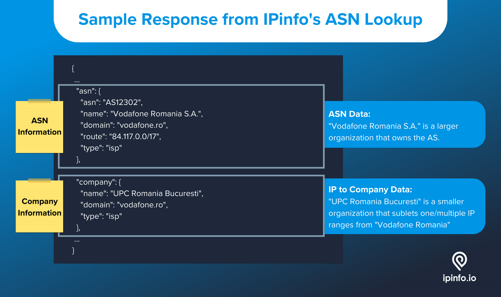
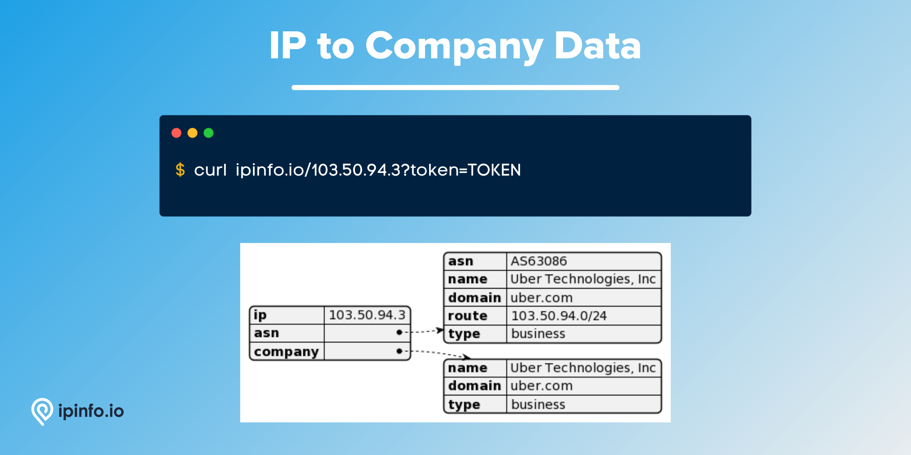

# IP to Company Database

## Identify organizations, their type, domain, ASN information, and the IP addresses they operate.

The core dataset for the IP to Company data is the WHOIS records. We parse and match domains from WHOIS records and provide a standardized document that can be used to identify companies and related information from IP addresses and vice-versa.

# Database Schema & Description

*[data updated as of May, 2024]*

| Field Name  | Example                 | Data Type | Notes                                                        |
|-------------|-------------------------|-----------|--------------------------------------------------------------|
| `start_ip`  | 107.136.106.168         | TEXT      | Starting IP address of an IP address range                   |
| `end_ip`    | 107.136.106.175         | TEXT      | Ending IP address of an IP address range                     |
| `join_key`  | 107.136.0.0             | TEXT      | Special variable to facilitate database `join` operation     |
| `name`      | ZSPEC FLOW-180709174314 | TEXT      | Name of the company operating the IP address range           |
| `domain`    | zspec.com               | TEXT      | Domain of the company                                        |
| `type`      | business                | TEXT      | Type of organization. e.g. Business, ISP, Hosting, Education |
| `asn`       | AS7018                  | TEXT      | ASN that owns the IP address range                           |
| `as_name`   | AT&T Services, Inc.     | TEXT      | Name of the ASN                                              |
| `as_domain` | att.com                 | TEXT      | Domain name of the ASN                                       |
| `as_type`   | isp                     | TEXT      | ASN Type: ISP, Hosting, Business or Education                |
| `country`   | US                      | TEXT      | ISO 3166 country code of the organization's location         |


> `join_key` represents the Class C network each IP address is part of, allowing you to filter the result set significantly before `join`ing. Learn more about `join_key` [here](https://community.ipinfo.io/t/ipinfos-join-key-column-explained/5526).
> 
> Please refer to "[How to choose the best file format for your IPinfo database?](https://ipinfo.io/blog/ipinfo-database-formats/)" article to select the best format possible for your use case.
>
> The usage of the IP data downloads relies on the software or application of the data. Check out our [documentation](https://ipinfo.io/developers/database-download), [community](https://community.ipinfo.io/c/docs/8), and our [integrations](https://ipinfo.io/integrations) pages to find the best path forward.

# API Response



As well as the database product, IPinfo also provides a robust API service. Please visit the [IPinfo Documentation](https://ipinfo.io/developers/data-types#company-data) portal to learn more. The IP to Company API service is available as part of our [Business Tier](https://ipinfo.io/developers/responses#business-plan) plan.

API Query:

```bash
$ curl ipinfo.io/$IP_ADDRESS/company?token=$TOKEN
```

Response:

```json
{
    "name": "Uber Technologies, Inc",
    "domain": "uber.com",
    "type": "isp"
}
```



> Ranges owned/operated by a particular organization can also be explored using the [IP ranges API service](https://ipinfo.io/products/ranges-api).

# Samples

- [CSV Database] [IP to Company Database Sample](/IP%20to%20Company/ip_company_sample.csv)
- [JSON Database] [IP to Company Database Sample](/IP%20to%20Company/ip_company_sample.json)
- [MMDB Database] [IP to Company Database Sample](/IP%20to%20Company/ip_company_sample.mmdb)
- [API] [IP to Company API Response Sample](/IP%20to%20Company/ip_company_api_sample.json)

# Guides, Resources & Links

## Links

🔗 [IP to Company Database Page](https://ipinfo.io/products/ip-company-database)

🔗 [IP to Company Data Downloads Documentation](https://ipinfo.io/developers/ip-to-company-database)

🔗 [IP to Company API Page](https://ipinfo.io/products/ip-company-api)

🔗 [IP to Company Data Type Documentation](https://ipinfo.io/developers/data-types#company-data)

## Article & Guides (2)

- [Choosing between the ASN, IP to ASN and IP to Company database](https://community.ipinfo.io/t/choosing-between-the-asn-ip-to-asn-and-ip-to-company-database/731)
- [Differences in data for the ASN and the IP to Company database](https://community.ipinfo.io/t/differences-in-data-for-the-asn-and-the-ip-to-company-database/730)
- [How to use IP address data to add value to sales funnels](https://ipinfo.io/blog/how-to-use-ip-address-data-to-add-value-to-sales-funnels/)
- [What firmographics can be gathered from IP address data](https://ipinfo.io/blog/company-data-from-ip-address/)
- [IPinfo Community posts on the IP to Company data](https://community.ipinfo.io/search?q=company)

---

# Interested in more?

Currently, we are limiting the sample datasets to only **100 rows**. If you would like to request a larger sample or would like to get a quote on the database products, **[feel free to reach to us](https://ipinfo.io/products/ip-database-download#request_form)**.

Follow us on [Twitter](https://twitter.com/ipinfo) and [LinkedIn](https://www.linkedin.com/company/ipinfo/) to learn more about IP Address data and it’s fascinating potential.

# About IPinfo

Founded in 2013, IPinfo prides itself on being the most reliable, accurate, and in-depth source of IP address data available anywhere. We process terabytes of data to produce our custom IP geolocation, company, carrier, VPN detection, hosted domains, and IP type data sets. Our API handles over 40 billion requests a month for 100,000 businesses and developers.


[](https://ipinfo.io/)
