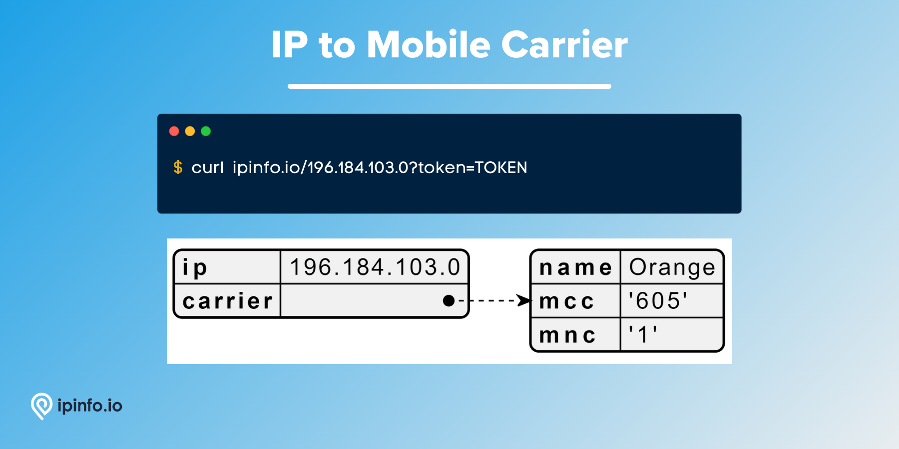

# IP to Mobile Carrier

## Get mobile carrier information (carrier, MCC, MNC) matched to IP addresses.

# Database Schema & Description

*[data updated as of August, 2022]*

The following database schema represents the CSV database. We also provide JSON and MMDB format data.

| Field Name | Example | Data Type | Notes |
| --- | --- | --- | --- |
| `start_ip` | 5.208.203.0 | TEXT | Starting IP address of an IP address range |
| `end_ip` | 5.208.203.255 | TEXT | Ending IP address of an IP address range |
| `join_key` | 5.208.0.0 | TEXT | Special variable to facilitate join operation |
| `name` | Mobile Communication Company of Iran PLC | TEXT | Name of the mobile carrier |
| `country` | IR | TEXT | ISO 3166 country code |
| `mcc` | 432 | TEXT | Mobile Country Code (MCC) of the carrier |
| `mnc` | 11 | TEXT | Mobile Network Code (MNC) of the carrier |

> `join_key` → This key represents the Class C network each IP address is part of, allowing you to filter the result set significantly before filtering to the exact IP address you want. [[*Source*](https://ipinfo.io/blog/ingesting-ipinfo-geolocation-data-with-postgresql-13/)]
> 

IP address data like `start_ip`, `end_ip` and `join_key` should be assigned `inet` data type if you are ingesting the data in PostgreSQL.

# API Response

As well as the database product, IPinfo also provides a robust API service. Please visit the [IPinfo Documentation](https://ipinfo.io/developers) portal to learn more.

```bash
$ curl ipinfo.io/IP_ADDRESS?token=TOKEN
```



# Samples

- [CSV Database] [IP to Mobile Carrier Database Sample](/IP%20to%20Mobile%20Carrier/ip_carrier_sample.csv)
- [API] [IP to Mobile Carrier API Response Sample](/IP%20to%20Mobile%20Carrier/ip_carrier_api_sample.json)

# Guides, Resources & Links

## Links

🔗 [IP to Mobile Carrier Database Page](https://ipinfo.io/products/mobile-ip-database)

🔗 [IP to Mobile Carrier API Page](https://ipinfo.io/products/ip-carrier-api)

🔗 [Carrier Information Data Type Documentation](https://ipinfo.io/developers/data-types#carrier-data)

## Articles & Guides (1)

- [How to develop a mobile app with a geolocation feature](https://ipinfo.io/blog/how-to-develop-a-mobile-application-software-with-a-geolocation-feature/)

---

# Interested in more?

Currently, we are limiting the sample datasets to only **200 rows**. If you would like to request a larger sample or would like to get a quote on the database products, **[feel free to reach to us](https://ipinfo.io/products/ip-database-download#request_form)**.

Follow us on [Twitter](https://twitter.com/ipinfoio) and [LinkedIn](https://www.linkedin.com/company/ipinfo/) to learn more about IP Address data and it’s fascinating potential.

# About IPinfo

Founded in 2013, IPinfo prides itself on being the most reliable, accurate, and in-depth source of IP address data available anywhere. We process terabytes of data to produce our custom IP geolocation, company, carrier, VPN detection, hosted domains, and IP type data sets. Our API handles over 40 billion requests a month for 100,000 businesses and developers.

[](https://ipinfo.io/)