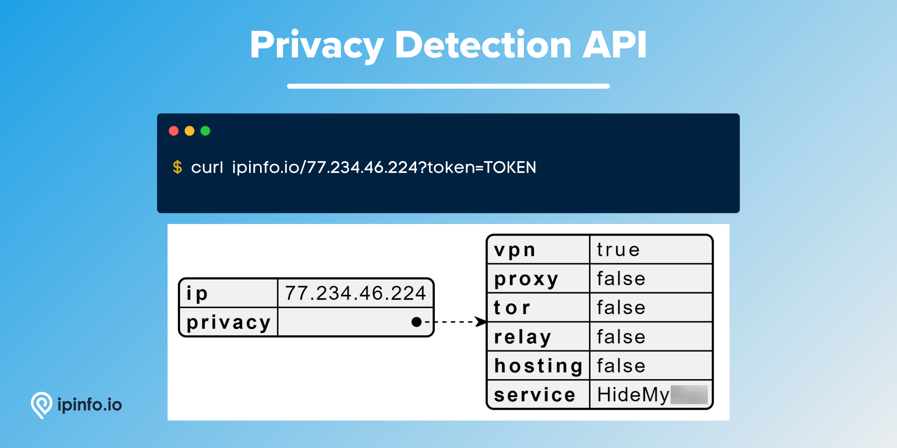

# Privacy Detection

## IP Addresses associated with identity hiding services such as VPN, Tor, Proxies, Relays and Hosting service.

# Database Schema & Description

*[data updated as of August, 2022]*

The following database schema represents the CSV database. We also provide JSON and MMDB format data.

| Field Name | Example | Data Type | Notes |
| --- | --- | --- | --- |
| `start_ip` | 115.9.76.79 | TEXT | Starting IP address of an IP address range |
| `end_ip` | 115.9.76.79 | TEXT | Ending IP address of an IP address range |
| `join_key` | 115.9.0.0 | TEXT | Special variable to facilitate join operation |
| `hosting` |  | BOOLEAN | Indicates a hosting IP address most of the time based on a datacenter. Indicative of bots, scrapers or malicious activities |
| `proxy` |  | BOOLEAN | Similar to VPN mainly used by businesses |
| `tor` |  | BOOLEAN | IP address originated from the Onion router |
| `vpn` | True | BOOLEAN | Virtual Private Network (VPN) service IP address |
| `relay` |  | BOOLEAN | Traffic relays often provided by CDN companies |
| `service` |  | TEXT | Name of the privacy service provider |

> `join_key` → This key represents the Class C network each IP address is part of, allowing you to filter the result set significantly before filtering to the exact IP address you want. [[*Source*](https://ipinfo.io/blog/ingesting-ipinfo-geolocation-data-with-postgresql-13/)]
> 

IP address data like `start_ip`, `end_ip` and `join_key` should be assigned `inet` data type if you are ingesting the data in PostgreSQL.

# API Response

As well as the database product, IPinfo also provides a robust API service. Please visit the [IPinfo Documentation](https://ipinfo.io/developers) portal to learn more.

🔗 [Privacy Data Documentation](https://ipinfo.io/developers/data-types#privacy-data)

# Samples

- [CSV Database] [Privacy Detection Database Sample](/Privacy%20Detection/privacy_detection_sample.csv)
- [MMDB Database] [Privacy Detection Database Sample](/Privacy%20Detection/privacy_detection_sample.mmdb)
- [API] [Privacy Detection API Response Sample](/Privacy%20Detection/privacy_detection_api_sample.json)

# Guides, Resources & Links

## Links

🔗 [Privacy Detection Database Type](https://ipinfo.io/products/anonymous-ip-database)
🔗 [Privacy Detection API Page](https://ipinfo.io/products/proxy-vpn-detection-api)
🔗 [Privacy Detection Data Type](https://ipinfo.io/developers/data-types#privacy-data)

## Articles & Guides (4)

- [Deep dive into privacy detection data and masked IPs](https://ipinfo.io/blog/deep-dive-into-privacy-detection-data-and-masked-ips/)
- [How to privacy-proof your online targeting](https://ipinfo.io/blog/privacy-adtech-online-targeting/)
- [5 businesses who use privacy detection data well](https://ipinfo.io/blog/using-privacy-detection-data/)
- [What to expect from our Privacy Detection API](https://ipinfo.io/blog/what-to-expect-from-our-privacy-detection-api/)

## FAQ (Frequently Asked Questions) (4)

- [Anonymous or masked IP address](https://ipinfo.io/faq/article/83-anonymous-or-masked-ip-address)
- [What is Tor?](https://ipinfo.io/faq/article/81-what-is-tor)
- [What is a proxy?](https://ipinfo.io/faq/article/82-what-is-proxy)
- [What is a VPN?](https://ipinfo.io/faq/article/80-what-is-vpn)

---

# Interested in more?

Currently, we are limiting the sample datasets to only **200 rows**. If you would like to request a larger sample or would like to get a quote on the database products, **[feel free to reach to us](https://ipinfo.io/products/ip-database-download#request_form)**.

Follow us on [Twitter](https://twitter.com/ipinfoio) and [LinkedIn](https://www.linkedin.com/company/ipinfo/) to learn more about IP Address data and it’s fascinating potential.

# About IPinfo

Founded in 2013, IPinfo prides itself on being the most reliable, accurate, and in-depth source of IP address data available anywhere. We process terabytes of data to produce our custom IP geolocation, company, carrier, VPN detection, hosted domains, and IP type data sets. Our API handles over 40 billion requests a month for 100,000 businesses and developers.

