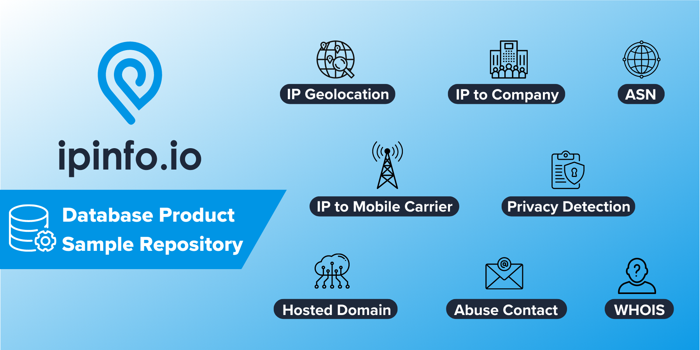

#  IPinfo Sample Database Repository

## Sample datasets of all the [IP address database products](https://ipinfo.io/account/data-downloads).

  

# Database Overview

The primary IP databases available for download are:

| Database Product                                                                 | Sample Database Repo                                        | Description                                                                 |
|----------------------------------------------------------------------------------|-------------------------------------------------------------|-----------------------------------------------------------------------------|
| [IPinfo Lite](https://ipinfo.io/lite)                                           | [IP Lite Sample](/IPinfo%20Lite)                            | The ultimate free IP database from IPinfo                                   |
| [IPinfo Core](https://ipinfo.io/core)                                           | [IP Core Sample](/IPinfo%20Core)                            | Location, ASN, and network flags IP database                                |
| [IPinfo Plus](https://ipinfo.io/plus)                                           | [IP Plus Sample](/IPinfo%20Plus)                            | Enterprise IP database with location, insights, network metadata, and flags |
| [IP to Residential Proxy Database](https://ipinfo.io/products/residential-proxy) | [IP to Residential Proxy Sample](/IP%20Residential%20Proxy) | IP to residential proxy or ISP proxy detection data                         |
| [Hosted Domain Database](https://ipinfo.io/products/hosted-domains-database)     | [Hosted Domains Sample](../Hosted%20Domains)                | Reverse IP lookup                                                           |
| [Abuse Contact Database](https://ipinfo.io/products/ip-abuse-contact-database)   | [Abuse Contact Sample](../Abuse%20Contact)                  | Abuse contact information                                                   |
| [WHOIS Database](https://ipinfo.io/products/ip-whois-data-download)              | [WHOIS Sample](../WHOIS)                                    | Contextualized and structured WHOIS database                                |
| IP to Privacy Detection Extended Database                                       | [IP to Privacy Detection Extended Sample](/Privacy%20Detection%20Extended) | IP to Privacy Detection database detection method information               |

**In addition to the above IP data downloads, we maintain several [legacy IP data downloads](/Legacy/README.md).**

**All of these products are available as CSV, JSON, Parquet, and MMDB types.**

# Features of the Repository

Please visit each folder to learn more about the databases. Each directory README contains:

- Sample Dataset (100 rows) in `.csv`, `.json`, `.parquet`, and `.mmdb` format
- API response (in `.json`)
- Breakdown of the dataset with a description of the fields
- Breakdown of the API response
- Helpful guides, resources, and articles

# Summary of the Databases

Please visit the individual database directories to learn more. The database schemas were generated in May 2024.

<h2>IPinfo Lite Database</h2>

**IPinfo's free IP database provides location (country + continent) and ASN information in a single database.**

You can find the schema, database sample, and other information in the **[IPinfo Lite folder](/IPinfo%20Lite)**. The database includes the following fields:

| Field Name         | Example                 | Description                                                             |
| ------------------ | ----------------------- | ---------------------------------------------------------------------- |
| **network**        | `154.24.39.204/30`      | CIDR/IP range or single IP address                                     |
| **country**        | `Canada`                | Country name                                                           |
| **country_code**   | `CA`                    | Two-letter ISO 3166 country code of the IP addresses                   |
| **continent**      | `North America`         | Continent name of the IP location                                      |
| **continent_code** | `NA`                    | Two-letter continent code of the IP location                           |
| **asn**            | `AS174`                 | Autonomous System Number, an organization that owns the IP range block |
| **as_name**        | `Cogent Communications` | Name of the AS (Autonomous System Number) organization                 |
| **as_domain**      | `cogentco.com`          | Official domain or website of the ASN organization                     |

<h2>IPinfo Core Database</h2>

**IPinfo's Core is a robust IP database that combines our location, ASN, and network flags data into a single database.**

You can find the schema, database sample, and other information in the **[IPinfo Core folder](/IPinfo%20Core)**. The database includes the following fields:

| Field Name     | Example                       | Description                                                                  |
| -------------- | ----------------------------- | ---------------------------------------------------------------------------- |
| network        | 66.202.64.131                 | CIDR/IP range or single IP address                                          |
| city           | Chicago                       | City of the IP address                                                      |
| region         | Illinois                      | Region/State of the IP address                                              |
| region_code    | IL                            | Region code in two-letter format in ISO 3166                                |
| country        | United States                 | Name of the country of the IP address                                       |
| country_code   | US                            | ISO 3166 country code of the IP address                                     |
| continent      | North America                 | Name of the continent                                                       |
| continent_code | NA                            | Continent name code in two-letter format                                    |
| latitude       | 41.85003                      | Latitude value of the IP address                                            |
| longitude      | -87.65005                     | Longitude value of the IP address                                           |
| timezone       | America/Chicago               | Local timezone of the IP address location                                   |
| postal_code    | 60666                         | Postal code or zip code of the IP address                                   |
| asn            | AS7029                        | Autonomous System Number (ASN)                                              |
| as_name        | Windstream Communications LLC | Organization domain name of the ASN                                         |
| as_domain      | windstream.com                | Name of the ASN organization                                                |
| as_type        | isp                           | ASN Type: ISP, Hosting, Education, Government, or Business                  |
| is_anonymous   | false                         | Indicates whether the IP address is anonymous.                              |
| is_anycast     | false                         | Indicates whether the IP address is an internet service hosting IP address  |
| is_hosting     | false                         | Indicates whether the IP address is a hosting/cloud/data center IP address  |
| is_mobile      | false                         | Indicates whether the IP address belongs to a mobile network                |
| is_satellite   | false                         | Indicates whether the IP address is part of a satellite internet connection |

<h2>IPinfo Plus Database</h2>

**IPinfo's Plus is an enterprise-grade IP database that includes location, insights, confidence, ASN, privacy, carrier, and network flags all in one.**

You can find the schema, database sample, and other information in the **[IPinfo Plus folder](/IPinfo%20Plus)**. The database includes the following fields:

| Field Name         | Example                        | Description                                                                                                 |
| ------------------ | ------------------------------ | ---------------------------------------------------------------------------------------------------------- |
| network            | 86.179.219.192/29              | CIDR/IP range or single IP address                                                                         |
| city               | Weymouth                       | City of the IP address                                                                                     |
| region             | England                        | Region/State of the IP address                                                                             |
| region_code        | ENG                            | Region code in two-letter format in ISO 3166                                                               |
| country            | United Kingdom                 | Name of the country of the IP address                                                                      |
| country_code       | GB                             | ISO 3166 country code of the IP address                                                                    |
| continent          | Europe                         | Name of the continent                                                                                      |
| continent_code     | EU                             | Continent name code in two-letter format                                                                   |
| latitude           | 50.61448                       | Latitude value of the IP address                                                                           |
| longitude          | -2.45991                       | Longitude value of the IP address                                                                          |
| timezone           | Europe/London                  | Local timezone of the IP address location                                                                  |
| postal_code        | DT3                            | Postal code or zip code of the IP address                                                                  |
| dma_code           | 13w                            | Direct Marketing Area (DMA) is a unique regional identifier for marketing.                                 |
| geoname_id         | 2634202                        | geonames.org's unique numercial identifier for geographic locations.                                       |
| radius             | 20                             | Location accuracy radius in terms of kilometers                                                            |
| asn                | AS2856                         | Autonomous System Number (ASN)                                                                             |
| as_name            | British Telecommunications PLC | Organization domain name of the ASN                                                                        |
| as_domain          | bt.com                         | Name of the ASN organization                                                                               |
| as_type            | isp                            | ASN Type: ISP, Hosting, Education, Government, or Business                                                  |
| carrier_name       |                                | Name of the mobile carrier organization                                                                    |
| mcc                |                                | Mobile Country Code (MCC) of the carrier                                                                   |
| mnc                |                                | Mobile Network Code (MNC) of the carrier                                                                   |
| as_changed         | 2025-01-10                     | Date when the IP address's ASN last changed: Date in YYYY-MM-DD format, ISO-8601                           |
| geo_changed        | 2024-11-10                     | Date when the IP address's location last changed: Date in YYYY-MM-DD format, ISO-8601                      |
| is_anonymous       | false                          | Indicates whether the IP address is anonymous.                                                             |
| is_anycast         | false                          | Indicates whether the IP address is an internet service hosting IP address                                   |
| is_hosting         | false                          | Indicates whether the IP address is a hosting/cloud/data center IP address                                |
| is_mobile          | false                          | Indicates whether the IP address belongs to a mobile network                                               |
| is_satellite       | false                          | Indicates whether the IP address is part of a satellite internet connection                                |
| is_proxy           | false                          | Indicates a open web proxy IP address                                                                      |
| is_relay           | false                          | Indicates location preserving anonymous relay service like iCloud private relay.                           |
| is_tor             | false                          | Indicates a TOR (The Onion Router) exit node IP address                                                    |
| is_vpn             | false                          | Indicates Virtual Private Network (VPN) service exit node IP address                                       |
| privacy_name       |                                | The name of the privacy service provider includes VPN, Proxy, or Relay service provider name               |

<h2>Hosted Domains / Reverse IP Lookup</h2>

**Hosted Domains database enables you to do reverse IP lookups.**

Through our Hosted Domains service, you can see the list of domains hosted on a single IP address. 

You can find the schema, database sample, API response sample, and other information in the **[Hosted Domains folder](/Hosted%20Domains)**. The database includes the following fields:

| Field Name | Example                                  | Description                                    |
| ---------- | ---------------------------------------- | ---------------------------------------------- |
| `ip`       | 135.125.236.225                          | IP address for reverse IP lookup               |
| `total`    | 3                                        | Number of domains registered to the IP Address |
| `domains`  | farmanaut.com,pharmanaut.be,farmanaut.be | Name of the domain(s) under the IP address     |

### 🔗 [Hosted Domains Database Product Page](https://ipinfo.io/products/hosted-domains-database)

<h2>Abuse Contact</h2>

**Get the abuse contact information of every ISP on the internet.**

You can find the schema, database sample, API response sample, and other information in the **[Abuse Contact folder](/Abuse%20Contact)**. The database includes the following fields:

| Field Name | Example                                           | Description                                              |
| ---------- | ------------------------------------------------- | -------------------------------------------------------- |
| `start_ip` | 119.93.20.248                                     | Starting IP address of an IP address block               |
| `end_ip`   | 119.93.20.255                                     | Ending IP address of an IP address block                 |
| `join_key` | 119.93.0.0                                        | Special variable to facilitate database `join` operation |
| `name`     | Nilo Agir                                         | Name of the abuse contact                                |
| `email`    | abuse@pldt.net                                    | Organizational email of the abuse contact                |
| `address`  | Philippine Long Distance Telephone Company, 6/... | Organizational address of the abuse contact              |
| `country`  | PH                                                | ISO 3166 country code                                    |
| `phone`    | +632-584-1045                                     | Organizational phone number of the abuse contact         |

### 🔗 [Abuse Contact Database Product Page](https://ipinfo.io/products/ip-abuse-contact-database)

<h2>Residential Proxy Detection Database</h2>

**Identify residential proxy IPs, including mobile network proxies, from more than 100 services**

You can find the schema, database sample, and other information in the **[Residential Proxy Detection folder](/IP%20Residential%20Proxy)**. The database includes the following fields:

| Fields              | Example          | Description                                                                                                                                                      |
| ------------------- | ---------------- | ---------------------------------------------------------------------------------------------------------------------------------------------------------------- |
| `ip`                | 38.222.31.85     | IP address associated with a residential proxy.                                                                                                                  |
| `service`           | lightningproxies | Name of the residential proxy service. Carrier/mobile services are suffixed with `_mobile` (e.g., soax_mobile).                                                  |
| `last_seen`         | 2024-09-07       | Last recorded active date of a residential proxy IP in ISO 8601 format (YYYY-MM-DD), with the timezone set to UTC.                                               |
| `percent_days_seen` | 2                | Integer representing the percentage of days an IP was active over the past 90 days, indicating its activity level and frequency within a residential proxy pool. |

<h2>Privacy Detection Extended</h2>

**Get detection method for each private IP address**

You can find the schema, database sample, API response sample, and other information in the **[Privacy Detection Extended folder](/Privacy%20Detection%20Extended)**. The database includes the following fields:

 | Field Name          | Example         | Data Type                                                                                                                                                                                                                                                                                                                             | Descrption |
 | ------------------- | --------------- | ------------------------------------------------------------------------------------------------------------------------------------------------------------------------------------------------------------------------------------------------------------------------------------------------------------------------------------- | ---------- |
 | **network**         | `45.129.35.234` | CIDR/IP Range or single IP address block                                                                                                                                                                                                                                                                                              |
 | **hosting**         | `true`          | Indicates a hosting/cloud service/data center IP address                                                                                                                                                                                                                                                                              |
 | **proxy**           | `false`         | Indicates a open web proxy IP address                                                                                                                                                                                                                                                                                                 |
 | **relay**           | `false`         | Indicates location preserving anonymous relay service                                                                                                                                                                                                                                                                                 |
 | **tor**             | `false`         | Indicates a TOR (The Onion Router) exit node IP address                                                                                                                                                                                                                                                                               |
 | **vpn**             | `true`          | Indicates Virtual Private Network (VPN) service exit node IP address                                                                                                                                                                                                                                                                  |
 | **service**         | `NordVPN`       | Name of the privacy service provider includes VPN, Proxy and Relay service providers names                                                                                                                                                                                                                                            |
 | **first_seen**      | `2024-10-31`    | Date when the activity on an anonymous IP address was first observed: Date in YYYY-MM-DD format, ISO-8601. Within the 3-month lookback period.                                                                                                                                                                                        |
 | **last_seen**       | `2025-01-03`    | Date when the activity on an anonymous IP address was last/recently observed: Date in YYYY-MM-DD format, ISO-8601.                                                                                                                                                                                                                    |
 | **confidence**      | `3`             | The level (from 1 to 3) of confidence attributed to the best source associated with this range                                                                                                                                                                                                                                        |
 | **coverage**        | `1.0`           | For inferred ranges (see `inferred` flag), represents the proportion of the range (in IP count) that we saw direct evidence of VPN activity on; the remaining percentage of the range (1 - coverage) is composed of IPs we did not directly observe. For IPs/ranges we've fully directly observed VPN evidence on, this value is 1.0. |
 | **census**          | `false`         | Ranges where we've observed VPN software/ports on; we run scans on ports and protocols commonly associated with VPN software. Ranges with the census flag are those where these scans obtained positive results                                                                                                                       |
 | **census_ports**    | ``              | The ports we've gotten positive results for when running our VPN detection census                                                                                                                                                                                                                                                     |
 | **device_activity** | `false`         | Ranges on which we've observed device activity compatible with VPN usage (outside of known infrastructure area; simultaneous use around a large area; pingable and/or associated with hosting providers)                                                                                                                              |
 | **inferred**        | `false`         | Whether the range associated with the record is the result of direct observation or inference based on neighboring IPs                                                                                                                                                                                                                |
 | **vpn_config**      | `true`          | Ranges where we confirmed VPN activity by directly running VPN software from almost 200 different providers and collecting exit IPs                                                                                                                                                                                                   |
 | **whois**           | `false`         | Ranges where we've observed VPN software/ports on AND have a WHOIS association with either VPNs in general or specific VPN providers. e.g. if our ipsec scan returned a positive result for an IP and its WHOIS record indicates that it is owned by a VPN provider, this flag will be true.                                          |

<h2>WHOIS</h2>

**IPinfo WHOIS database is a contextual, robust and consistent database of various types of WHOIS data.**

You can find the schema, database sample, API response sample, and other information in the **[WHOIS folder](/WHOIS)**. The WHOIS database and their respective fields are listed below:

### R WHOIS

| Field Name  | Example                             | Description                         |
| ----------- | ----------------------------------- | ----------------------------------- |
| `range`     | 50.28.18.195                        | IP Address range/netblock           |
| `id`        | NETBLK-GRADOCEROPUB.50.28.18.195/32 | Raw netblock identifier from WHOIS  |
| `name`      | Grado Cero Publicidad S.A. de C.V.  | Name of netblock                    |
| `descr`     | GRADOCEROPUB-50.28.18.195           | Description                         |
| `host`      | rwhois.liquidweb.com:4321           | Host information                    |
| `country`   | MX                                  | ISO 3166 country code               |
| `email`     | webmaster@gradocero.com             | Contact email information           |
| `abuse`     | abuse@sourcedns.com                 | Abuse email information             |
| `domain`    | gradocero.com                       | Domain associated with the netblock |
| `country.1` | MX                                  | Secondary country information       |
| `city`      | Naucalpan de Juarez                 | City information                    |
| `street`    | Calle Andes #46                     | Street information                  |
| `postal`    | 53125                               | Postal Code information             |
| `updated`   | 2021-01-26 00:00:00                 | Update date in the WHOIS registry   |
| `imported`  | 2021-01-27 04:44:47.206483          | Imported date in the WHOIS registry |

### RIR WHOIS

| Field Name     | Example                                    | Description                                                                                                          |
| -------------- | ------------------------------------------ | -------------------------------------------------------------------------------------------------------------------- |
| `range`        | 45.142.160.224-45.142.161.255              | IP Address range/netblock                                                                                            |
| `id`           | PL-DOMYNET-NETWORK                         | Raw netblock identifier from WHOIS                                                                                   |
| `name`         | DomyNet Sp. z o.o.                         | Name of netblock                                                                                                     |
| `country`      | PL                                         | ISO 3166 country code                                                                                                |
| `status`       | ASSIGNED PA                                | Range assignment type ([RIPE’s documentation](https://www.ripe.net/publications/docs/ripe-733))                      |
| `tech`         | PK9274-RIPE                                | ID for technical contact of WHOIS record                                                                             |
| `maintainer`   | MNT-PL-DOMYNET-1                           | ID for contact authorized to update WHOIS record for netblock                                                        |
| `admin`        | PK9274-RIPE                                | ID for administrative contact of netblock                                                                            |
| `source`       | ripe                                       | RIR associated with record (RIPE, ARIN, etc.)                                                                        |
| `whois_domain` | domynet.pl                                 | Domain name (from WHOIS entry)                                                                                       |
| `updated`      | 2020-01-09                                 | Last updated date (taken from WHOIS entry)                                                                           |
| `org`          | ORG-DSZO39-RIPE                            | ID or name of organization responsible for netblock                                                                  |
| `rdns_domain`  | domynet.pl                                 | Domain associated with IP range (only available if a majority of IPs within range share a common reverse DNS domain) |
| `domain`       | domynet.pl                                 | Domain associated with netblock (based on our data sets)                                                             |
| `geoloc`       | 52.2260524 20.9941955                      | Latitude/longitude coordinates indicating where users of network are located                                         |
| `org_address`  | ul. Lindleya 16/301 02-013 Warszawa POLAND | Address of the associated organization                                                                               |
| `asn`          | AS208348                                   | Autonomous system number for organization that routes traffic for IP (based on BGP routing data)                     |
| `as_name`      | DomyNet Sp. z o.o.                         | Name of AS (based on our data sets and data processing)                                                              |
| `as_domain`    | domynet.pl                                 | Domain of AS (based on our data sets and data processing)                                                            |
| `as_type`      | isp                                        | ISP, business, or hosting (based on around 20 different features and our custom training set)                        |

<h3>Other WHOIS Databases</h3>

Other kinds of WHOIS Database IPinfo offers:

| WHOIS ASN | WHOIS MNT | WHOIS NET | WHOIS ORG  | WHOIS POC   |
| --------- | --------- | --------- | ---------- | ----------- |
| id        | id        | range     | id         | id          |
| name      | name      | id        | name       | name        |
| country   | admin_id  | name      | address    | mobilephone |
| org_id    | tech_id   | country   | street     | officephone |
| created   | org_id    | domain    | city       | fax         |
| updated   | created   | org_id    | state      | addres      |
| source    | updated   | status    | postalcode | country     |
| raw       | source    | tech_id   | country    | email       |
|           | raw       | mnt_id    | admin_id   | abuse_email |
|           |           | admin_id  | tech_id    | created     |
|           |           | created   | abuse_id   | updated     |
|           |           | updated   | mnt_id     | source      |
|           |           | source    | email      | raw         |
|           |           | raw       | domain     |             |
|           |           |           | created    |             |
|           |           |           | updated    |             |
|           |           |           | source     |             |
|           |           |           | raw        |             |

### 🔗 [WHOIS Database Product Page](https://ipinfo.io/products/ip-whois-data-download)

# Relevant Articles

## Guides

We highly recommend exploring the [IPinfo community](https://community.ipinfo.io/) for posts and detailed instructions on using our database. Feel free to participate in the community if you have any questions.

- [Database downloads articles in the community](https://community.ipinfo.io/c/docs/database-downloads/10)
- [Lookup IP geolocation and ASN with ClickHouse and IPinfo’s free database](https://community.ipinfo.io/t/lookup-ip-geolocation-and-asn-with-clickhouse-and-ipinfos-free-database/149)
- [Using IPinfo’s MMDB data downloads with Golang](https://community.ipinfo.io/t/using-ipinfos-mmdb-data-downloads-with-golang/4415)
- [How to choose the best file format for your IPinfo database?](https://ipinfo.io/blog/ipinfo-database-formats/)
- [Ingesting IPinfo geolocation data with PostgreSQL 13](https://ipinfo.io/blog/ingesting-ipinfo-geolocation-data-with-postgresql-13/)

## FAQs

The list of FAQs (Frequently Asked Questions) can be found [here](https://ipinfo.io/faq/category/137-data-downloads) or in the [IPinfo Community](https://community.ipinfo.io/).

# Found a bug?

If you found an issue or would like to submit an improvement to this project, please submit an issue using the issues tab above. If you would like to submit a PR with a fix, reference the issue you created!

# Interested in more?

Currently, we are limiting the sample datasets to only **100 rows**. If you would like to request a larger sample or would like to get a quote on the database products, **[feel free to reach out to us](https://ipinfo.io/products/ip-database-download#request_form)**.

Follow us on [Twitter](https://twitter.com/ipinfo) and [LinkedIn](https://www.linkedin.com/company/ipinfo/) to learn more about IP Address data and its fascinating potential.

---

# IPinfo Tools

There are official IPinfo client libraries available for many languages including PHP, Python, Go, Java, Ruby, and many popular frameworks such as Django, Rails, and Laravel. There are also many third-party libraries and integrations available for our API.

See [https://ipinfo.io/developers/libraries](https://ipinfo.io/developers/libraries) for more details.

# About IPinfo

Founded in 2013, IPinfo prides itself on being the most reliable, accurate, and in-depth source of IP address data available anywhere. We process terabytes of data to produce our custom IP geolocation, company, carrier, VPN detection, hosted domains, and IP type data sets. Our API handles over 40 billion requests a month for 100,000 businesses and developers.

