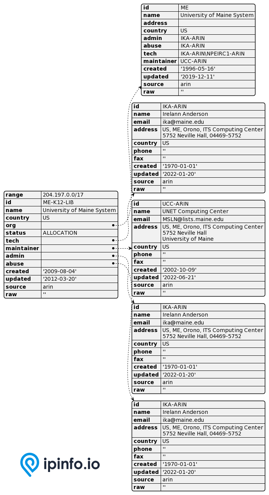

# WHOIS Database

## Comprehensive, contextual and updated WHOIS data to lookup IP address and domain ownership, point of contact, organization, networks etc.

# Database Schema & Description

*[data updated as of August, 2022]*

The following database schema represents the CSV database. We also provide JSON and MMDB format data.

Expand each section to learn about each database.


<details>
<summary>
<h2>R WHOIS</h2>
</summary>

Parsed and normalized data we have collected from different RIRs. We also provide additional  fields to provide context to the data.

| Field Name | Example | Data Type | Notes |
| --- | --- | --- | --- |
| `range` | 50.28.18.195 | TEXT | IP Address range/netblock |
| `id` | NETBLK-GRADOCEROPUB.50.28.18.195/32 | TEXT | Raw netblock identifier from WHOIS |
| `name` | Grado Cero Publicidad S.A. de C.V. | TEXT | Name of netblock |
| `descr` | GRADOCEROPUB-50.28.18.195 | TEXT | Description |
| `host` | rwhois.liquidweb.com:4321 | TEXT | Host information |
| `country` | MX | TEXT | ISO 3166 country code |
| `email` | webmaster@gradocero.com | TEXT | Contact email information |
| `abuse` | abuse@sourcedns.com | TEXT | Abuse email information |
| `domain` | gradocero.com | TEXT | Domain associated with the netblock |
| `country.1` | MX | TEXT | Secondary country information |
| `city` | Naucalpan de Juarez | TEXT | City information |
| `street` | Calle Andes #46 | TEXT | Street information |
| `postal` | 53125 | TEXT | Postal Code information |
| `updated` | 2021-01-26 00:00:00 | TEXT | Update date in the WHOIS registry |
| `imported` | 2021-01-27 04:44:47.206483 | TEXT | Imported date in the WHOIS registry |

</details>

<details>
<summary>
<h2>RIR WHOIS</h2>
</summary>

RIR WHOIS data is created by parsing IP WHOIS data from the regional Internet Registries. Aside from normalizing and structuring the data from different RIR, we include additional contexts and insights.

| Field Name | Example | Data Type | Notes |
| --- | --- | --- | --- |
| `range` | 45.142.160.224-45.142.161.255 | TEXT | IP Address range/netblock |
| `id` | PL-DOMYNET-NETWORK | TEXT | Raw netblock identifier from WHOIS |
| `name` | DomyNet Sp. z o.o. | TEXT | Name of netblock |
| `country` | PL | TEXT | ISO 3166 country code |
| `status` | ASSIGNED PA | TEXT | Range assignment type ([RIPE’s documentation](https://www.ripe.net/publications/docs/ripe-733)) |
| `tech` | PK9274-RIPE | TEXT | ID for technical contact of WHOIS record |
| `maintainer` | MNT-PL-DOMYNET-1 | TEXT | ID for contact authorized to update WHOIS record for netblock |
| `admin` | PK9274-RIPE | TEXT | ID for administrative contact of netblock |
| `source` | ripe | TEXT | RIR associated with record (RIPE, ARIN, etc.) |
| `whois_domain` | domynet.pl | TEXT | Domain name (from WHOIS entry) |
| `updated` | 2020-01-09 | TEXT | Last updated date (taken from WHOIS entry) |
| `org` | ORG-DSZO39-RIPE | TEXT | ID or name of organization responsible for netblock |
| `rdns_domain` | domynet.pl | TEXT | Domain associated with IP range (only available if a majority of IPs within range share a common reverse DNS domain) |
| `domain` | domynet.pl | TEXT | Domain associated with netblock (based on our data sets) |
| `geoloc` | 52.2260524 20.9941955 | TEXT | Latitude/longitude coordinates indicating where users of network are located |
| `org_address` | ul. Lindleya 16/301 02-013 Warszawa POLAND | TEXT | Address of the associated organization |
| `asn` | AS208348 | TEXT | Autonomous system number for organization that routes traffic for IP (based on BGP routing data) |
| `as_name` | DomyNet Sp. z o.o. | TEXT | Name of AS (based on our data sets and data processing) |
| `as_domain` | domynet.pl | TEXT | Domain of AS (based on our data sets and data processing) |
| `as_type` | isp | TEXT | ISP, business, or hosting (based on around 20 different features and our custom training set) |

</details>

<details>
<summary>
<h2>WHOIS ASN (Autonomous System Numbers)</h2>
</summary>

ASN Data matched to WHOIS data for contextual data.

| Field Name | Example | Data Type | Notes |
| --- | --- | --- | --- |
| `id` | AS3670 | TEXT | ASN information |
| `name` | Optimum Group | TEXT | Name of the netblock |
| `country` | US | TEXT | ISO 3166 country code |
| `org_id` | OPT | TEXT | Organization id of the netblock |
| `created` | 1994-06-10 | TEXT | Created date in the WHOIS registry |
| `updated` | 1995-12-08 | TEXT | Update date in the WHOIS registry |
| `source` | arin | TEXT | RIR associated with the record |
| `raw` | ASHandle: AS3670 OrgID: PT A... | TEXT | Raw data field |

</details>

<details>
<summary>
<h2>WHOIS MNT (Maintainer)</h2>
</summary>

| Field Name | Example | Data Type | Notes |
| --- | --- | --- | --- |
| `id` | NETFIL-MNT | TEXT | ID for the contact authorized to update record |
| `name` | NETFIL SRL BULEVARDUL RACOTEANU NR.163A FILI... | TEXT | Name and information of the mnt contact |
| `admin_id` | VD1057-RIPE | TEXT | Administrative contact id of the netblock |
| `tech_id` | VD1057-RIPE | TEXT | Technical contact id of the netblock |
| `org_id` | ORG-NS89-RIPE | TEXT | Organization responsible for the netblock |
| `created` | 2010-04-14 | TEXT | Created date in the WHOIS registry |
| `updated` | 2010-04-14 | TEXT | Updated date in the WHOIS registry |
| `source` | ripe | TEXT | RIR associated with the record |
| `raw` | mntner: NETFIL-MNT descr: NE... | TEXT | Raw data field |

`updated` and `created` values can be set to `datetime` data type.

</details>


<details>
<summary>
<h2>WHOIS NET (Networks)</h2>
</summary>

Network information from WHOIS registry  

| Field Name | Example | Data Type | Notes |
| --- | --- | --- | --- |
| `range` | 148.59.204.0/23 | TEXT | Netblock range |
| `id` | IN | TEXT | Raw netblock identifier from WHOIS |
| `name` | iTel Networks Inc | TEXT | Name of the netblock |
| `country` | CA | TEXT | ISO 3166 country code |
| `domain` | itel.com | TEXT | Domain associated with the netblock |
| `org_id` | IN | TEXT | Organization id of the netblock in the RIR db |
| `status` | ALLOCATION | TEXT | Range assignment type (see details) |
| `tech_id` | ABO24-ARIN JONAS30-ARIN RINKD-ARIN TRIGG15-... | TEXT | ID for technical contact |
| `mnt_id` | ITELN-ARIN | TEXT | ID for contact authorized to update the record |
| `admin_id` | RINKD-ARIN | TEXT | Administrative contact id of the netblock |
| `abuse_id` | ABUSE3422-ARIN | TEXT | Abuse contact id of the netblock |
| `created` | 2016-10-07 | TEXT | Created date in the WHOIS registry |
| `updated` | 2016-10-07 | TEXT | Updated date in the WHOIS registry |
| `source` | arin | TEXT | RIR associated with the record |
| `raw` | NetHandle: NET-148-59-204-0-1 OrgID: ... | TEXT | Raw data field |

`updated` and `created` values can be set to `datetime` data type.

</details>


<details>
<summary>
<h2>WHOIS ORG (Organization)</h2>
</summary>

Organization information from WHOIS registry

| Field Name | Example | Data Type | Notes |
| --- | --- | --- | --- |
| `id` | CTC-7 | TEXT | ID of the organization responsible for the netblock |
| `name` | Communications Technology Center | TEXT | Name of the organization responsible for the netblock |
| `address` |  | TEXT | Address information of the organization |
| `street` | IT Division PO Box 42495 | TEXT | Street address information of the organization |
| `city` | Olympia | TEXT | City of the organization |
| `state` | WA | TEXT | State / Region of the organization |
| `postalcode` | 98504-2495 | TEXT | Postal code information of the organization |
| `country` | US | TEXT | ISO 3166 country code |
| `admin_id` | NIEDK-ARIN | TEXT | Administrative contact id of the netblock |
| `tech_id` | NIEDK-ARIN | TEXT | Technical contact ID of the netblock |
| `abuse_id` | ABUSE135-ARIN NIEDK-ARIN | TEXT | Abuse contact ID of the netblock |
| `mnt_id` | NIEDK-ARIN | TEXT | ID for the contact authorized to update record |
| `email` |  | TEXT | Email information of the organization |
| `domain` | sbctc.edu | TEXT | Domain associated with the netblock |
| `created` | 1994-04-19 | TEXT | Created date in the WHOIS registry |
| `updated` | 2015-11-24 | TEXT | Updated date in the WHOIS registry |
| `source` | arin | TEXT | RIR associated with the record |
| `raw` | OrgID: CTC-7 OrgName: Communi... | TEXT | Raw data field |

`updated` and `created` values can be set to `datetime` data type.

</details>


<details>
<summary>
<h2>WHOIS POC (Point of Contact)</h2>
</summary>

WHOIS database registry from point of contact

| Field Name | Example | Data Type | Notes |
| --- | --- | --- | --- |
| `id` | TRONT-ARIN | TEXT | ID of the netblock owner |
| `name` | Matthew Tront | TEXT | Name of the point of contact of the organization responsible for the netblock |
| `mobilephone` | +1-302-521-3780 | TEXT | Organizational mobile phone number of the point of contact |
| `officephone` | +1-215-873-2200 | TEXT | Organizational office phone number of the point of contact |
| `fax` | +1-215-645-0383 | TEXT | Organizational fax number of the point of contact |
| `address` | US, PA, Philadelphia, 456 North 5th St., 19123 | TEXT | Address of the point of contact of the netblock owner |
| `country` | US | TEXT | ISO 3166 country code |
| `email` | mtront@destcorp.com | TEXT | Email of the point of contact of the netblock owner |
| `abuse_email` | mtront@destcorp.com | TEXT | Abuse contact of the point of contact of the netblock owner |
| `created` | 2014-11-12 | TEXT | Created date in the WHOIS registry |
| `updated` | 2014-11-12 | TEXT | Updated date in the WHOIS registry |
| `source` | arin | TEXT | RIR associated with the record |
| `raw` | POCHandle: TRONT-ARIN IsRole: … | TEXT | Raw data field |

`updated` and `created` values can be set to `datetime` data type.

</details>

# API Response

As well as the database product, IPinfo also provides a robust API service. Please visit the [IPinfo Documentation](https://ipinfo.io/developers) portal to learn more.


Please check out the code snippets for the API commands and their respective responses:

## Search Net records by Net ID

```bash
curl ipinfo.io/whois/net/NET_ID?token=TOKEN
```

Please see the sample JSON in the codebase. This is a **truncated** version of the JSON response.

 

## **Search Net records by IP or IP Range**

```bash
curl ipinfo.io/whois/net/IP_RANGE?token=TOKEN
```

Please see the sample JSON in the codebase. This is a **truncated** version of the JSON response.

 

## **Search Net records by domain**

```bash
curl ipinfo.io/whois/net/DOMAIN?token=TOKEN
```

Please see the sample JSON in the codebase. This is a **truncated** version of the JSON response.

 

## **Search Net records by ASN**

```bash
curl ipinfo.io/whois/net/ASN?token=TOKEN
```

Please see the sample JSON in the codebase. This is a **truncated** version of the JSON response.


## **Search Org records by Org ID**

```bash
curl ipinfo.io/whois/org/PINEAP?token=TOKEN
```

Please see the sample JSON in the codebase. This is a **truncated** version of the JSON response.

 

## **Search POC records by POC ID**

```bash
curl ipinfo.io/whois/poc/POC?token=TOKEN
```

Please see the sample JSON in the codebase. This is a **truncated** version of the JSON response.


## Filtering records by sources

All our WHOIS API queries supports source parameter to filter records by RIR associated with the record.

```bash
curl ipinfo.io/whois/poc/CP312-ARIN?token=TOKEN&source=arin
```

# Samples

- [CSV Database] [RWHOIS Database Sample](/WHOIS/rwhois_sample.csv)
- [CSV Database] [RIR WHOIS Database Sample](/WHOIS/whois_rir_sample.csv)
- [CSV Database] [WHOIS ASN Database Sample](/WHOIS/whois_asn_sample.csv)
- [CSV Database] [WHOIS MNT Database Sample](/WHOIS/whois_mnt_sample.csv)
- [CSV Database] [WHOIS NET Database Sample](/WHOIS/whois_net_sample.csv)
- [CSV Database] [WHOIS ORG Database Sample](/WHOIS/whois_org_sample.csv)
- [CSV Database] [WHOIS POC Database Sample](/WHOIS/whois_poc_sample.csv)
- [MMDB Database] [RWHOIS Database Sample](/WHOIS/rwhois_sample.mmdb)
- [MMDB Database] [RIR WHOIS Database Sample](/WHOIS/whois_rir_sample.mmdb)
- [JSON Database] [RWHOIS Database Sample](/WHOIS/rwhois_sample.json)
- [JSON Database] [RIR WHOIS Database Sample](/WHOIS/whois_rir_sample.json)
- [JSON Database] [WHOIS MNT Database Sample](/WHOIS/whois_mnt_sample.json)
- [JSON Database] [WHOIS NET Database Sample](/WHOIS/whois_net_sample.json)
- [JSON Database] [WHOIS ORG Database Sample](/WHOIS/whois_org_sample.json)
- [JSON Database] [WHOIS POC Database Sample](/WHOIS/whois_poc_sample.json)
- [API] [WHOIS ASN API Response Sample](/WHOIS/API/whois_asn_api_sample.json)
- [API] [WHOIS Domain API Response Sample](/WHOIS/API/whois_domain_api_sample.json)
- [API] [WHOIS IP Range API Response Sample](/WHOIS/API/whois_ip_range_api_sample.json)
- [API] [WHOIS NET API Response Sample](/WHOIS/API/whois_net_api_sample.json)
- [API] [WHOIS ORG API Response Sample](/WHOIS/API/whois_org_api_sample.json)
- [API] [WHOIS POC API Response Sample](/WHOIS/API/whois_poc_api_sample.json)
 

# Guides, Resources & Links

## Links

- [IP WHOIS Database Page](https://ipinfo.io/products/ip-whois-data-download)
- [IP WHOIS API Page](https://ipinfo.io/products/whois-api)
- [IP WHOIS API Documentation](https://ipinfo.io/developers/whois)

## Articles & Guides (2)

- [Our downloadable IP WHOIS data sets are live!](https://ipinfo.io/blog/our-downloadable-ip-whois-data-sets-are-live)
- [RIPE WHOIS Database Query Reference Manual](https://www.ripe.net/publications/docs/ripe-358)

## FAQs (Frequently Asked Questions) (1)

- [What is WHOIS IP lookup? How does it work?](https://ipinfo.io/faq/article/73-what-is-whois-ip-lookup-how-does-it-work)

---

# Interested in more?

Currently, we are limiting the sample datasets to only **100 rows**. If you would like to request a larger sample or would like to get a quote on the database products **[feel free to reach to us](https://ipinfo.io/products/ip-database-download#request_form)**.

Follow us on [Twitter](https://twitter.com/ipinfo) and [LinkedIn](https://www.linkedin.com/company/ipinfo/) to learn more about IP Address data and it’s fascinating potential.

# About IPinfo

Founded in 2013, IPinfo prides itself on being the most reliable, accurate, and in-depth source of IP address data available anywhere. We process terabytes of data to produce our custom IP geolocation, company, carrier, VPN detection, hosted domains, and IP type data sets. Our API handles over 40 billion requests a month for 100,000 businesses and developers.

[https://avatars3.githubusercontent.com/u/15721521?s=128&u=7bb7dde5c4991335fb234e68a30971944abc6bf3&v=4](https://avatars3.githubusercontent.com/u/15721521?s=128&u=7bb7dde5c4991335fb234e68a30971944abc6bf3&v=4)